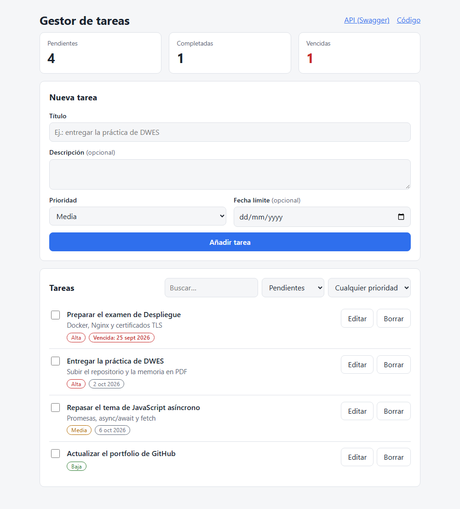
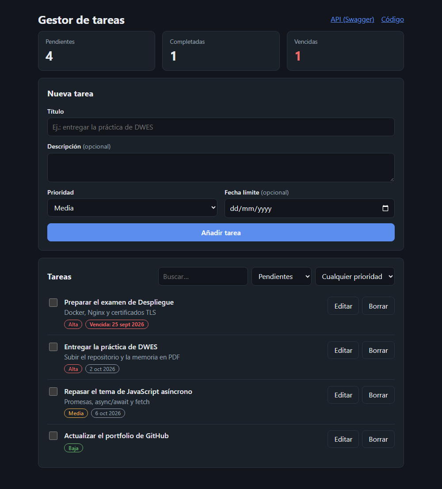
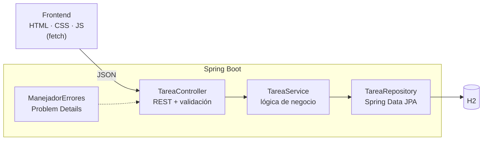

# Gestor de tareas · Spring Boot + JavaScript

[](https://github.com/pablosanchezcontento-afk/desarrollo-web/actions/workflows/ci.yml)


Aplicación web completa para organizar tareas con **prioridad** y **fecha
límite**. Tiene un backend con API REST en **Spring Boot**, persistencia con
**JPA + H2**, documentación **OpenAPI/Swagger** y un frontend en **HTML, CSS y
JavaScript** sin frameworks.

| Modo claro | Modo oscuro |
|---|---|
|  |  |

## Funcionalidades

- Crear, editar, completar y borrar tareas.
- Prioridad (alta, media o baja) y fecha límite opcional. Las tareas **vencidas** se resaltan.
- Filtros por estado y prioridad, y búsqueda de texto en el título y la descripción.
- Resumen de pendientes, completadas y vencidas.
- Validación en el servidor con mensajes de error claros en la interfaz.
- Modo oscuro automático y diseño adaptado a móvil.
- Los datos se conservan entre reinicios.

## Arquitectura



| Capa | Responsabilidad |
|---|---|
| `TareaController` | Traduce HTTP ⇄ Java y valida la entrada con Bean Validation. |
| `TareaService` | Reglas de negocio (qué es una tarea vencida, resumen). Recibe un `Clock` para poder probarlo con una fecha fija. |
| `TareaRepository` | Consultas con filtros opcionales en JPQL. |
| `ManejadorErrores` | Devuelve los errores en formato estándar [RFC 9457](https://www.rfc-editor.org/rfc/rfc9457). |
| DTO (`TareaRequest`, `TareaResponse`) | La entidad JPA nunca se expone directamente en la API. |

## API REST

Documentación interactiva en **<http://localhost:8080/swagger-ui.html>** con la aplicación arrancada.

| Método | Ruta | Descripción | Respuesta |
|---|---|---|---|
| `GET` | `/api/tareas?completada=&prioridad=&q=` | Listar con filtros opcionales | `200` |
| `GET` | `/api/tareas/resumen` | Recuento por estado | `200` |
| `GET` | `/api/tareas/{id}` | Obtener una tarea | `200` / `404` |
| `POST` | `/api/tareas` | Crear | `201` + `Location` / `400` |
| `PUT` | `/api/tareas/{id}` | Modificar | `200` / `400` / `404` |
| `PATCH` | `/api/tareas/{id}/completada` | Marcar como hecha o pendiente | `200` / `404` |
| `DELETE` | `/api/tareas/{id}` | Borrar | `204` / `404` |

```bash
curl -X POST http://localhost:8080/api/tareas \
     -H "Content-Type: application/json" \
     -d '{"titulo": "Entregar la práctica", "prioridad": "ALTA", "fechaLimite": "2026-10-15"}'
```

Ejemplo de error de validación:

```json
{
  "title": "Datos no válidos",
  "status": 400,
  "detail": "La petición contiene errores de validación",
  "errores": { "titulo": "El título es obligatorio" }
}
```

## Ejecutar

### Con Java (JDK 21)

No hace falta instalar Maven: el proyecto incluye Maven Wrapper.

```bash
./mvnw spring-boot:run        # Linux / macOS / Git Bash
mvnw.cmd spring-boot:run      # Windows (cmd o PowerShell)
```

Abre <http://localhost:8080>. La primera vez se crean unas tareas de ejemplo.
Para empezar sin ellas: `./mvnw spring-boot:run -Dspring-boot.run.arguments=--app.datos-ejemplo=false`.

### Con Docker

```bash
docker build -t gestor-tareas .
docker run -p 8080:8080 -v gestor-datos:/app/data gestor-tareas
```

La imagen arranca con el perfil **`prod`** (`application-prod.properties`): consola de H2 desactivada, sin
datos de ejemplo y sin trazas en los errores. Corre como usuario sin privilegios y declara un `HEALTHCHECK`.

### Otras URL útiles

| URL | Qué es |
|---|---|
| `/swagger-ui.html` | Documentación interactiva de la API |
| `/v3/api-docs` | Especificación OpenAPI en JSON |
| `/actuator/health` | Estado de la aplicación |
| `/h2-console` | Consola de la base de datos, **solo en desarrollo** (URL JDBC `jdbc:h2:file:./data/tareas`, usuario `sa`) |

### Seguridad

Todas las respuestas llevan `X-Content-Type-Options`, `Referrer-Policy` y `Permissions-Policy`. La página y la
API llevan además una **Content-Security-Policy** estricta (solo recursos propios, sin scripts ni estilos en
línea) y `X-Frame-Options: DENY`. El frontend pinta los datos con `textContent`, nunca con `innerHTML`, y una
prueba E2E comprueba que un título con HTML se muestra literal.

## Pruebas

```bash
./mvnw verify    # 37 tests + cobertura mínima (95 % líneas, 90 % ramas) en target/site/jacoco/

# Pruebas en navegador contra la aplicación real (necesita Node 20+):
./mvnw -q package -DskipTests
cd e2e && npm ci && npx playwright install chromium && npx playwright test
```

| Tipo | Clase | Qué prueba |
|---|---|---|
| Unitario | `TareaTest` | Normalización de datos y cálculo de "vencida" |
| Capa de datos | `TareaRepositoryTest` (`@DataJpaTest`) | Filtros, orden y contadores de las consultas |
| Integración | `TareaApiTest` (`@SpringBootTest` + MockMvc) | Todos los endpoints, validaciones, códigos HTTP, OpenAPI y health |
| Integración | `SeguridadYDatosTest` | Datos de ejemplo (una sola vez) y cabeceras de seguridad |
| E2E | `e2e/tests/tareas.spec.js` (Playwright) | Crear, validar, vencidas, completar, editar, borrar con confirmación, búsqueda y filtros, HTML no interpretado, sin violaciones de CSP y **accesibilidad WCAG 2.1 AA con axe en modo claro y oscuro** |

Los tests fijan "hoy" con un `Clock` (`RelojFijo`) para que los resultados no dependan del día.

La integración continua (GitHub Actions) ejecuta los tests con el umbral de cobertura, las pruebas en
navegador, construye la imagen Docker y comprueba que el contenedor arranca, responde, no expone la consola de
H2 y envía la CSP.

## Estructura

```text
src/main/java/es/pablosanchez/tareas/
├── GestorTareasApplication.java
├── tarea/          # entidad, DTO, repositorio, servicio y controlador
└── web/            # configuración y manejo de errores
src/main/resources/
├── application.properties
└── static/         # frontend: index.html, styles.css, app.js
src/test/java/...   # tests unitarios, de datos y de integración
e2e/                # pruebas en navegador con Playwright + axe
```

## Tecnologías

Java 21 · Spring Boot 4.1 (Web MVC, Data JPA, Validation, Actuator) · H2 ·
springdoc-openapi · JUnit 6 · MockMvc · JaCoCo · Playwright · axe-core · HTML5 · CSS · JavaScript (ES2022) ·
Docker · GitHub Actions

## Autor

**Pablo Sánchez Contento** · [GitHub](https://github.com/pablosanchezcontento-afk)
